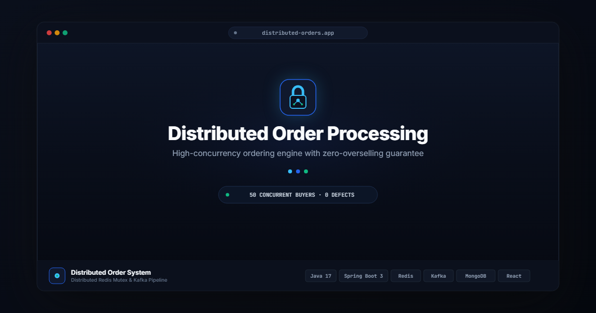

# Distributed Order Processing System

A production-grade distributed order processing engine built to eliminate inventory overselling under high-concurrency burst traffic and orchestrate asynchronous order fulfillment. It implements **distributed concurrency control via Redis (Redisson)**, **idempotent transaction intake with SHA-256 payload fingerprinting**, **asynchronous event streaming with Apache Kafka**, **transactional saga compensation for payment failures**, and an **interactive system telemetry dashboard**.

---

## Architecture Overview

<p align="center">
  
</p>

<details>
<summary><b>View Text Blueprint (ASCII Diagram)</b></summary>

```
                            [ React Frontend (Vite) ]
                           (http://localhost:3000)
                                      │
                         REST API (HTTP / JSON)
                                      │
                                      ▼
                        [ Module 1: order-service ]
                           (http://localhost:8080)
                         ┌────────────┴────────────┐
                         │                         │
                         ▼                         ▼
         [ Redis: lock:inventory:{productId} ]   [ MongoDB: orders & products ]
         (Redisson distributed lock: 500ms wait)  (Atomic $gte stock check & update)
                         │
                  Kafka Event: order-placed
                         │
                         ▼
                     [ Apache Kafka Cluster ]
                         │
                         ▼
                     [ Module 2: processing-service ]
                         ├─────────────────────────────────────────┐
                         │                                         │
                         ▼                                         ▼
                 [ Payment Worker ]                        [ Shipping Worker ]
             (Group: payment-workers)                   (Group: shipping-workers)
              • Happy path: PAYMENT_PROCESSED            • Generates tracking ID
              • Emits: order-payment-processed           • Updates status: SHIPPED
              • Failure path (prod-fail-payment or 99):  • Emits: order-shipped
                - Updates status: FAILED
                - Emits: order-payment-failed
                         │
                         ▼
             [ Compensation Consumer ]
             (Group: compensation-workers)
              • Acquires Redis lock: lock:inventory:{productId}
              • Restores stock in MongoDB: $inc: { stock: +qty }
              • Logs compensation in order statusHistory
```
</details>

---

## Architectural & Design Decision Rationale

### 1. Why Redis Distributed Lock over Database Pessimistic Locking (`SELECT ... FOR UPDATE`)
- **Connection Pool Exhaustion & Row Contention:** In high-concurrency flash sales, database pessimistic locks hold open relational database connections and transactions for the duration of stock checks, external calls, and entity writes. Under heavy traffic (e.g. 50+ concurrent buyers for 1 item), database connection pools quickly saturate, leading to thread starvation and system-wide latency degradation.
- **Granular Partitioning:** The Redis lock partitions contention strictly per product using the key format `lock:inventory:{productId}`. Purchases for Product B are completely unaffected by a thundering herd on Product A.
- **Microsecond In-Memory Execution:** Redis executes in-memory with sub-millisecond roundtrips. Threads acquire or fail the lock within a 500ms wait window (`tryLock(500, 3000, TimeUnit.MILLISECONDS)`), serializing access safely before touching MongoDB.
- **Automatic Deadlock Guard (TTL):** The 3000ms lease time ensures locks expire automatically if a JVM node crashes or suffers a network partition while holding a lock.
- **Defense-in-Depth:** The Redis lock is backed by an atomic MongoDB decrement guard (`stock >= quantity`), guaranteeing zero overselling even if a lock were forcibly evicted.

### 2. Why Apache Kafka over Direct Synchronous REST Calls
- **Temporal Decoupling & Availability:** Payment gateways and shipping courier APIs suffer latency spikes and intermittent outages. If `order-service` made synchronous HTTP calls to Payment and Shipping providers during order placement, checkout latency would be 3–5+ seconds, and any gateway downtime would immediately fail client orders.
- **Immediate User Acknowledgment:** With Kafka, `order-service` reserves inventory, creates the order in initial state `PLACED`, and returns HTTP `201 Created` within ~20ms. Downstream processing occurs asynchronously in workers.
- **Independent Elastic Scaling:** `payment-workers` and `shipping-workers` run in isolated consumer groups. If shipping dispatch is slow, payment processing continues unimpeded, and workers can scale horizontally by adding Kafka consumer partitions.
- **Built-in Replayability & Dead Lettering:** In the event of temporary downstream crashes, Kafka consumer offsets guarantee no lost events, allowing safe retry upon recovery.

### 3. Idempotency & Replay Protection
- **SHA-256 Payload Fingerprinting:** Clients supply an `Idempotency-Key` header (UUID). `IdempotencyService` computes a SHA-256 hash of `productId + ":" + quantity`.
- **Duplicate Safe Returns:** If a completed request is resent with the identical payload (e.g. user refreshed the page or network timed out), the cached HTTP 201 response is returned without re-decrementing stock.
- **Payload Tampering Detection:** If a client reuses an idempotency key with modified product or quantity parameters, the service detects the hash mismatch and immediately rejects the call with HTTP **`422 Unprocessable Entity`** (`IDEMPOTENCY_KEY_PAYLOAD_MISMATCH`).
- **Concurrent Request Gate:** If a duplicate arrives while the first request is still `IN_PROGRESS`, it returns HTTP **`409 Conflict`** (`ORDER_ALREADY_PROCESSING`).

---

## Project Structure

```
Distributed order processing/
├── docker-compose.yml                  # MongoDB, Redis, Zookeeper, Kafka, Microservices, Frontend
├── BUILD_ORDER.md                      # Hour-by-hour implementation schedule
├── README.md                           # Architecture and operations guide
│
├── order-service/                      # Module 1: Spring Boot REST API & Order Intake (Port 8080)
│   ├── src/main/java/com/distributed/orderservice/
│   │   ├── config/                     # RedissonConfig, KafkaProducerConfig, MongoConfig, WebCorsConfig
│   │   ├── controller/                 # OrderController, ProductController
│   │   ├── service/                    # OrderService, InventoryLockService, IdempotencyService
│   │   ├── repository/                 # ProductRepository, OrderRepository, IdempotencyKeyRepository
│   │   ├── model/                      # Product, Order, IdempotencyRecord, OrderStatus
│   │   └── exception/                  # GlobalExceptionHandler, domain exceptions
│   └── src/test/java/com/distributed/orderservice/
│       ├── OrderServiceConcurrencyTest.java          # 50-thread concurrent race condition test
│       ├── IdempotencyServiceUnitTest.java           # Caching, in-progress 409, and payload mismatch 422
│       ├── OrderServiceUnitTest.java                 # Business logic, stock bounds, lock failures
│       └── OrderProcessingEndToEndIntegrationTest.java # Testcontainers (Mongo, Redis, Kafka)
│
├── processing-service/                 # Module 2: Kafka Consumers & Saga Workers (Port 8081)
│   ├── src/main/java/com/distributed/processingservice/
│   │   ├── config/                     # KafkaConfig, RedissonConfig
│   │   ├── consumer/                   # PaymentConsumer, ShippingConsumer, CompensationConsumer
│   │   ├── service/                    # PaymentProcessor, ShippingProcessor, InventoryCompensationService
│   │   ├── producer/                   # ProcessingEventPublisher
│   │   └── repository/                 # OrderRepository, ProductRepository
│   └── src/test/java/com/distributed/processingservice/
│       ├── PaymentProcessorUnitTest.java             # Payment success & deterministic failure trigger
│       ├── ShippingProcessorUnitTest.java            # Shipping dispatch & tracking assignment
│       └── CompensationConsumerUnitTest.java         # Saga stock compensation under Redis lock
│
└── frontend/                           # Module 3: React Vite Frontend (Port 3000)
    ├── src/
    │   ├── api.js                      # Fetch client targeting real backend at localhost:8080 (No Mocks)
    │   ├── components/
    │   │   ├── ProductList.jsx         # Screen 1: Product catalog, live stock badges, scenario tags
    │   │   ├── PlaceOrder.jsx          # Screen 2: Order form + 10-Buyer Concurrent Race Simulator
    │   │   └── OrderStatus.jsx         # Screen 3: Visual Kafka pipeline stepper & status audit log
    │   ├── App.jsx                     # Top navigation, tab switching, and state coordination
    │   └── index.css                   # Responsive styling, scoreboard, pulsing stepper, timeline
    ├── vite.config.js                  # Port 3000, proxy to 8080
    └── package.json
```

---

## Baseline Product Catalog & Concurrency Test Fixtures

The catalog is pre-seeded with items across multiple categories representing distinct concurrency and inventory profiles:

| Category | Product Name | SKU | Price | Stock | Concurrency & Pipeline Profile |
|---|---|---|---|---|---|
| **Phones** | **Apple iPhone 15 Pro** | `prod-iphone-15-pro` | $999.00 | **1** | Single-unit inventory (high-contention flash-sale profile) |
| **Phones** | **Samsung Galaxy S24 Ultra** | `prod-samsung-s24` | $1299.00 | **15** | Standard multi-unit concurrent purchasing |
| **Phones** | **Google Pixel 8 Pro** | `prod-pixel-8-pro` | $899.00 | **8** | Moderate concurrency load |
| **Books** | **Designing Data-Intensive Applications** | `prod-book-ddia` | $44.99 | **50** | High inventory (bulk multi-unit ordering) |
| **Books** | **System Design Interview (Vol 1 & 2)** | `prod-book-system-design` | $39.99 | **35** | High-volume purchasing |
| **Books** | **Database Internals: A Deep Dive** | `prod-book-db-internals` | $49.99 | **20** | Standard flow |
| **Hardware** | **Sony WH-1000XM5 Headphones** | `prod-sony-wh1000xm5` | $349.99 | **1** | Single-unit inventory race condition testing |
| **Hardware** | **Apple MacBook Pro 14"** | `prod-macbook-pro-m3` | $1999.00 | **5** | High cart value checkout |
| **Hardware** | **Keychron K2 Mechanical Keyboard** | `prod-keychron-k2` | $89.99 | **12** | Standard ordering |
| **Hardware** | **Dell UltraSharp 27 4K Monitor** | `prod-dell-ultrasharp` | $549.99 | **0** | Out-of-stock guard (immediate HTTP 409 rejection) |
| **Chaos Lab** | **Simulated Payment Fail Item** | `prod-fail-payment` | $99.99 | **10** | Deterministic payment failure trigger for saga compensation |

---

## How to Run the Application

### Option A: Using Docker Compose (Full Stack)

```bash
# Start all infrastructure, backend services, and frontend in one command:
docker compose up --build
```
- Frontend UI: `http://localhost:3000`
- Order Service REST API: `http://localhost:8080`
- Processing Service: `http://localhost:8081`

### Option B: Running Locally (Development Mode)

#### 1. Start Infrastructure (MongoDB, Redis, Kafka)
```bash
docker compose up mongo redis zookeeper kafka -d
```

#### 2. Run `order-service`
```bash
cd order-service
.\mvnw.cmd spring-boot:run
```

#### 3. Run `processing-service`
```bash
cd processing-service
.\mvnw.cmd spring-boot:run
```

#### 4. Run `frontend`
```bash
cd frontend
npm install
npm run dev
```
Open `http://localhost:3000` in your browser.

---

## Running the Automated Test Suite

### 1. `order-service` Tests (10 tests, 0 failures)
```bash
cd order-service
.\mvnw.cmd test -Dtest="OrderServiceUnitTest,IdempotencyServiceUnitTest,OrderServiceConcurrencyTest"
```
**Features Tested:**
- `testConcurrentOrderPlacement_RaceConditionGuard`: 50 concurrent threads targeting 1 stock item.
  - Assertions: Exactly 1 success (201), 49 failures (409), final stock = 0, total orders = 1.
- `testIdempotency_DuplicateKeyReturnsCachedResponse`: Cached 201 return.
- `testIdempotency_ReplayWithMismatchedPayloadReturns422`: HTTP 422 on payload tampering.
- `testIdempotency_ConcurrentInProgressReturns409`: HTTP 409 on duplicate in-flight requests.
- `testPlaceOrder_OutOfStock` & `testPlaceOrder_LockAcquisitionFailed`: Rejection mapping to 409.

### 2. `processing-service` Tests (5 tests, 0 failures)
```bash
cd processing-service
.\mvnw.cmd test
```
**Features Tested:**
- `testPaymentProcessing_Success`: Event consumption and transition to `PAYMENT_PROCESSED`.
- `testPaymentProcessing_DeterministicFailureTrigger_ByProductId`: `prod-fail-payment` triggers `FAILED` state and compensation event.
- `testPaymentProcessing_DeterministicFailureTrigger_ByQuantity`: `quantity=99` triggers `FAILED` state.
- `testShippingProcessing_Success`: Transition to `SHIPPED` with generated tracking number.
- `testCompensation_ReplenishesStockUnderRedisLock`: Restores inventory in MongoDB under Redis lock.

### 3. Testcontainers End-to-End Integration Test
```bash
cd order-service
.\mvnw.cmd test -Dtest="OrderProcessingEndToEndIntegrationTest"
```
*Spins up real MongoDB, Redis, and Kafka containers via Testcontainers to verify end-to-end event flow and status transition history.*

---

## Frontend System Telemetry Console

1. **Screen 1: Product Inventory Telemetry**
   - Displays real-time catalog synchronized directly from `GET /api/products`.
   - Category filtering (`ALL`, `PHONES`, `BOOKS`, `HARDWARE`, `CHAOS LAB`) and one-click catalog restock (`POST /api/products/reset`).
   - Color-coded stock status badges (In Stock, Low Stock, Out of Stock).
2. **Screen 2: Direct Order Placement & High-Contention Simulator**
   - **Single Order Placement:** Select catalog target, quantity, and specify or auto-generate UUID `Idempotency-Key`.
   - **High-Contention Simulator:**
     - Select a limited SKU (e.g. `Stock: 1`).
     - Set concurrency count $N$ (up to 1,000 concurrent requests) and trigger **"Blast N Concurrent Buyers"**.
     - Real-time scoreboard visualizes total requests fired, allocated orders (`201 Created`), and shed contention (`409 Conflict: OUT_OF_STOCK` or `LOCK_ACQUISITION_FAILED`).
     - Terminal execution trace stream shows sub-millisecond thread arrival, lock acquisition, and direct click-to-track order navigation.
3. **Screen 3: Order Telemetry & Kafka Pipeline Stepper**
   - Given an Order ID, polls `GET /api/orders/{orderId}` every 1.5 seconds.
   - Visual Stepper transitions live through async stages:
     `[ 1. PLACED ] ──> [ 2. PAYMENT_PROCESSED ] ──> [ 3. SHIPPED ]`
   - Active stages pulse cyan, completed stages turn emerald green.
   - Chronological audit log below the stepper displays immutable transition timestamps committed to MongoDB `statusHistory`.
